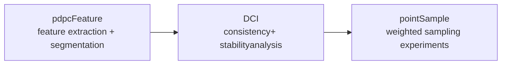

# PointDCI: Quantifying Multi-scale Structural Significance in 3D Point Clouds

<p align="center">
  <a href="./CITATION.cff"></a>
  <a href="./CONTRIBUTING.md"></a>
  <a href="./THIRD_PARTY.md"></a>
</p>

<p align="center">
  Research monorepo for the paper code of <strong>PointDCI</strong>
</p>

`pointDCI` is a research monorepo for our point-cloud detail contribution analysis pipeline. The repository packages three connected stages in one place: upstream feature extraction, downstream DCI descriptor generation, and weighted sampling experiments built on top of the DCI outputs.

Current paper title: `PointDCI: Quantifying Multi-scale Structural Significance in 3D Point Clouds`
Authors: Ruifeng Zhao, Yubo Men, Yongmei Liu, Chaoguang Men, Jin Li, Zeyu Tian
Status: submitted to `The Visual Computer`

## Why This Repo Exists

This repository versions the full experimental chain together because each downstream stage consumes artifacts produced by the earlier stages:

- `pdpcFeature` extracts multi-scale features, segmentation outputs, and auxiliary files.
- `DCI` computes consistency and stability descriptors from those outputs.
- `pointSample` uses DCI-derived values for weighted sampling experiments.

If you want to inspect or reproduce the paper pipeline, this repository is the public entry point.

## Project Layout


| Module                         | Role                                       | What it produces                                                           |
| ------------------------------ | ------------------------------------------ | -------------------------------------------------------------------------- |
| [`pdpcFeature`](./pdpcFeature) | Preprocessing and multi-scale segmentation | point cloud components, segments, variations, scales, and export artifacts |
| [`DCI`](./DCI)                 | Detail contribution analysis               | consistency and stability descriptors, colorized outputs, analysis files |
| [`pointSample`](./pointSample) | Weighted sampling experiments              | weighted FPS results and comparison outputs                                |

## Pipeline Overview



The intended public workflow is:

1. Run `pdpcFeature` to extract multi-scale features and segmentation outputs.
2. Feed the exported point cloud, component, segment, variation, and scale files into `DCI`.
3. Optionally feed the point cloud together with DCI-derived `consistency` and `stability` values into `pointSample`.

## Quick Start

Build each subproject independently:

```bash
cmake -S pdpcFeature -B build/pdpcFeature -DCMAKE_BUILD_TYPE=Release
cmake --build build/pdpcFeature -j

cmake -S DCI -B build/DCI -DCMAKE_BUILD_TYPE=Release
cmake --build build/DCI -j

cmake -S pointSample -B build/pointSample -DCMAKE_BUILD_TYPE=Release
cmake --build build/pointSample -j
```

Lowest-friction public path:

1. Build [`pdpcFeature`](./pdpcFeature) to generate components, segments, variations, and scales.
2. Build [`DCI`](./DCI) to access the public `improved` executable.
3. Build [`pointSample`](./pointSample) if you also want the weighted-sampling experiments.

Repository-local smoke test for the DCI public entry point:

```bash
cmake -S DCI -B build/DCI -DCMAKE_BUILD_TYPE=Release
cmake --build build/DCI -j
./build/DCI/src/improved DCI/examples/minimal/config.json
```

This minimal example validates the public config format and output path behavior. It is intentionally tiny and does not represent the full paper-scale workload.

## Module Notes

### `pdpcFeature`

Modified upstream preprocessing stage based on Plane-Detection-Point-Cloud, extended with export, logging, persistence-based segmentation output, and `.vg` generation.

See [`pdpcFeature/README.md`](./pdpcFeature/README.md).

### `DCI`

Main downstream analysis stage. The public build defaults to the `improved` executable, which reads a JSON config and exports descriptor files beside the input data.

See [`DCI/README`](./DCI/README).

### `pointSample`

Research-oriented weighted sampling module for comparing uniform and DCI-guided strategies such as `consistency`, `stability`, and `consistency_stability`.

See [`pointSample/README.md`](./pointSample/README.md).

## Citation

Repository citation metadata is provided in [`CITATION.cff`](./CITATION.cff).

Current manuscript metadata:

- Title: `PointDCI: Quantifying Multi-scale Structural Significance in 3D Point Clouds`
- Authors: Ruifeng Zhao, Yubo Men, Yongmei Liu, Chaoguang Men, Jin Li, Zeyu Tian
- Venue status: submitted to `The Visual Computer`

Until final bibliographic metadata is available, please cite the repository together with the exact release or commit you used.

## License Layout

This monorepo does not apply a single root license to every file.

- Files under [`pdpcFeature`](./pdpcFeature) are distributed under the license in [`pdpcFeature/LICENSE`](./pdpcFeature/LICENSE).
- Files under [`DCI`](./DCI) are distributed under the license in [`DCI/LICENSE`](./DCI/LICENSE).
- Files under [`pointSample`](./pointSample) are distributed under the license note in [`pointSample/LICENSE`](./pointSample/LICENSE), which follows the same GPL-3.0-or-later terms used by `DCI`.

Additional bundled third-party components are summarized in [`THIRD_PARTY.md`](./THIRD_PARTY.md). Repository-level release notes are summarized in [`LICENSES.md`](./LICENSES.md).

## Status

This is research code prepared for open-source release.

- The public `DCI` build defaults to the main `improved` executable only; research-only executables are opt-in.
- A repository-local DCI smoke example is provided under [`DCI/examples/minimal`](./DCI/examples/minimal).
- Some helper scripts remain research-oriented and are documented as such rather than treated as stable APIs.
